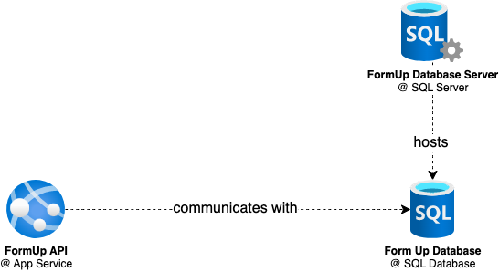

# Deployment

This application is developed in a way that deployment is as easy as it can be. That's why CI/CD and cloud 
deployments are utilized with the focus to automate the repetitive tasks.

## Setting up
### Infrastructure
First when preparing this project for deployment, we need to set up infrastructure on which the project will be 
running. 

> [!NOTE]  
> Infrastructure as a Code is not on the project roadmap for the near future.

In order for application to be correctly communicating with database, we need to provide our application a 
connection string to database. 

You can do that in: App Service Dashboard → Settings → Configuration → Connection 
Strings → New Connection String. 

Be sure to give the database connection string name `ConnectionStrings__Database`. Value of connection string can be 
found in the SQL Database Dashboard → Settings → Connection Strings → ADO.NET (SQL Authentication). Be sure to 
substitute `Password=(your_password)` with password you set up when creating the database. 
 

### Continuous Integration
CI pipelines have already set up targets to which code should be deployed. But if we are starting from scratch we 
need to set some more things up. 

As of now, only thing that needs to be externally provided for our pipelines is the value of `${{ secrets.
AZURE_PUBLISH_PROFILE }}`. You can retrieve this value in App Service Dashboard → Download Publish Profile. In order 
to provide this value to pipelines, you need to create this value as a [secret](https://docs.github.com/en/actions/security-guides/using-secrets-in-github-actions) in environment used by actions. Name the secret as 
`AZURE_PUBLISH_PROFILE` and as a value paste the contains of file containing publish profile. 