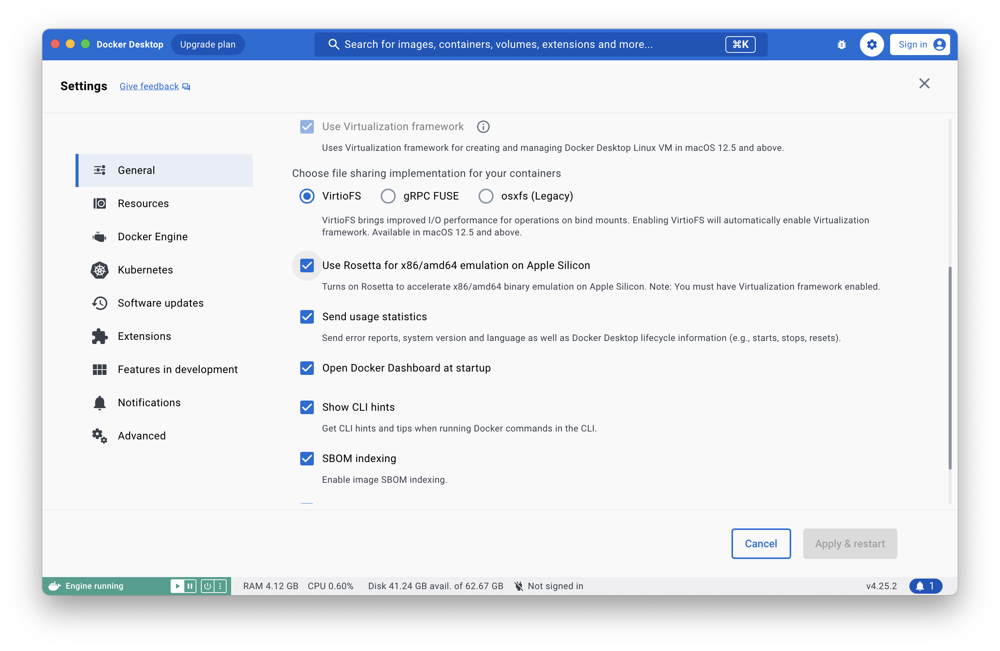

# Troubleshooting

## Can't run MSSQL image on Apple Silicon Macs

If you are trying to run this application on Mac with Apple Silicon, you might see this error message in MSSQL 
container log

```text
SQL Server 2022 will run as non-root by default.
This container is running as user mssql.
To learn more visit https://go.microsoft.com/fwlink/?linkid=2099216.
/opt/mssql/bin/sqlservr: Invalid mapping of address 0x400976b000 in reserved address space below 0x400000000000. Possible causes:
1) the process (itself, or via a wrapper) starts-up its own running environment sets the stack size limit to unlimited via syscall setrlimit(2);
2) the process (itself, or via a wrapper) adjusts its own execution domain and flag the system its legacy personality via syscall personality(2);
3) sysadmin deliberately sets the system to run on legacy VA layout mode by adjusting a sysctl knob vm.legacy_va_layout.
```

This is due to the fact, that MSSQL image is not yet supported on the ARM architecture.

One solution for this might be enabling Rosetta. Make sure that in Docker settings you have "Use Rosetta for 
x86/amd64 emulation on Apple Silicon" option **checked**.
